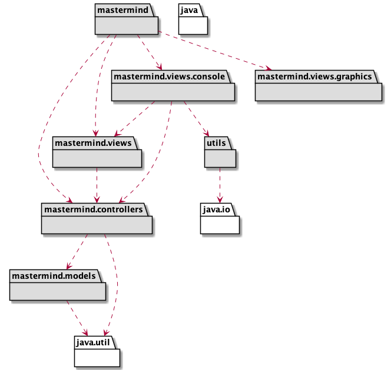

# MasterMind Final Practice

* **Author**: Javier Prieto Cepeda - javier.prieto.cepeda@alumnos.upm.es
* **Version**: Mastermind game implementation with double dispatching

# Structure

The structure of this repository is:

* **docs**: This folder has the UML diagrams sources and images.
* **src**: This folder has the mastermind code (Java language).
* **pom.xml**: This file has the maven project configuration.

# Requisites

* Wiki - Youtube: https://www.youtube.com/watch?v=2-hTeg2M6GQ
* Funcionalidad: Básica
* Interfaz: Texto
* Distribución: Standalone
* Persistencia: No

# Project Design

## Arquitecture

## Packages

### mastermind

### mastermind.views

### mastermind.views.console

### mastermind.controllers

### mastermind.models

### mastermind.utils

